<div align="center">

# 🐉 Julián Aragón

### Data · Artificial Intelligence · Software · Mathematics

**Data Analyst · Math Teacher · AI Engineering Student**

*Turning data, ideas and problems into useful things.*

<br>

[](https://github.com/JulyAnAr88)
[](https://www.python.org/)
[](https://www.postgresql.org/)
[](https://www.docker.com/)

</div>

---

## 🧬 About me

I'm **Julián**, a Data Analyst and Mathematics Teacher currently studying **Artificial Intelligence Engineering**.

My interests live at the intersection of:

```text
                         MATHEMATICS
                              │
                              ▼
                           DATA
                              │
                 ┌────────────┼────────────┐
                 ▼            ▼            ▼
               ANALYTICS     ETL       VISUALIZATION
                 │            │            │
                 └────────────┼────────────┘
                              ▼
                          SOFTWARE
                              │
                 ┌────────────┼────────────┐
                 ▼            ▼            ▼
                AI           NLP        AUTOMATION
                 │            │            │
                 └────────────┼────────────┘
                              ▼
                       REAL PROBLEMS
```

I enjoy taking a real-world problem, understanding the data behind it, and building something useful from it.

---

## 🔭 What I'm working on

* 📊 **Data Analytics & Business Intelligence**
* 🧠 **Machine Learning & Artificial Intelligence**
* 🐍 **Python for data and software development**
* 🗄️ **PostgreSQL & relational databases**
* 🔄 **ETL, data pipelines & automation**
* 📈 **Data visualization & dashboards**
* 🤖 **NLP, local AI & intelligent systems**
* 🐳 **Docker & self-hosted infrastructure**
* 🌱 **Open Source technologies**

---

# 🛠️ Tech Stack

### Data & AI

<p align="left">


</p>

### Development

<p align="left">


</p>

### Infrastructure

<p align="left">


</p>

### Also exploring

`Apache Superset` · `n8n` · `Apache Airflow` · `Apache Hop` · `FastAPI` · `Whisper` · `Redis/Celery` · `Local LLMs`

---

# 🚀 Featured Projects

Projects that represent different parts of my learning and development journey.

### 📊 Data, Automation & AI

| Project                                                                | Description                                                                                                                                        |
| ---------------------------------------------------------------------- | -------------------------------------------------------------------------------------------------------------------------------------------------- |
| **[mg-datos](https://github.com/JulyAnAr88/mg-datos)**                 | **Automation and data processing**, combining programming, data transformation and automated workflows to make repetitive tasks more reproducible. |
| **[MonitoringSystem](https://github.com/JulyAnAr88/MonitoringSystem)** | Software development and system monitoring.                                                                                                        |

> Some repositories are academic projects, experiments or learning exercises.
> Others are prototypes built to explore a technology or solve a specific problem.

---

# 📊 GitHub Statistics

<div align="center">




</div>

---

# ⚡ Contribution Streak

<div align="center">


</div>

---

# 📈 Activity

<div align="center">


</div>

---

# 🧠 Current Learning Path

```text
                    ┌───────────────────────┐
                    │ ARTIFICIAL INTELLIGENCE│
                    └───────────┬───────────┘
                                │
              ┌─────────────────┼─────────────────┐
              ▼                 ▼                 ▼
       MACHINE LEARNING        NLP             LOCAL AI
              │                 │                 │
              └─────────────────┼─────────────────┘
                                ▼
                         DATA ENGINEERING
                                │
                 ┌──────────────┼──────────────┐
                 ▼              ▼              ▼
                ETL             BI        AUTOMATION
                 │              │              │
                 └──────────────┼──────────────┘
                                ▼
                          REAL PROBLEMS
```

I'm especially interested in the point where **data engineering, analytics, software and AI meet**.

---

# 🧪 This GitHub is also my laboratory

Not everything here is intended to be production software.

Some repositories are:

🧩 Academic projects
🔬 Experiments
📚 Learning exercises
🤖 AI prototypes
⚙️ Automation experiments
🛠️ Proofs of concept
🎮 Things I built because they looked fun

That's intentional.

> **Build → break → understand → improve → repeat.**

---

# 🎲 Beyond technology

When I'm not working with data or code, I enjoy:

🎲 Board games
🎮 Strategy & video games
📚 Science fiction
🐉 Fantasy
🧩 Mathematics & problem solving
🎬 Movies & series
🌏 Technology, open source and random things worth learning

---

<div align="center">

### 🐉 Keep learning. Keep building.

</div>


